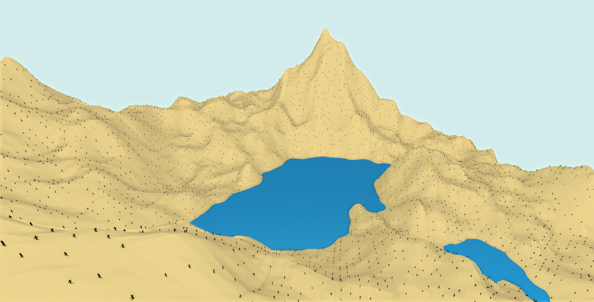

#Procedural terrain with three.js
The goal of this project was to render procedurally generated terrain with camera control, illumination, and loading of models and textures in a web browser with the help of the WebGL library three.js.
A diamond square algorithm is used for heightmap generation, which in turn uses a Mersenne Twister for pseudorandom number generation based on a seed value.

##Resources used
three.js library and related examples: <https://github.com/mrdoob/three.js/>
Mersenne Twiser library: <https://github.com/pigulla/mersennetwister>